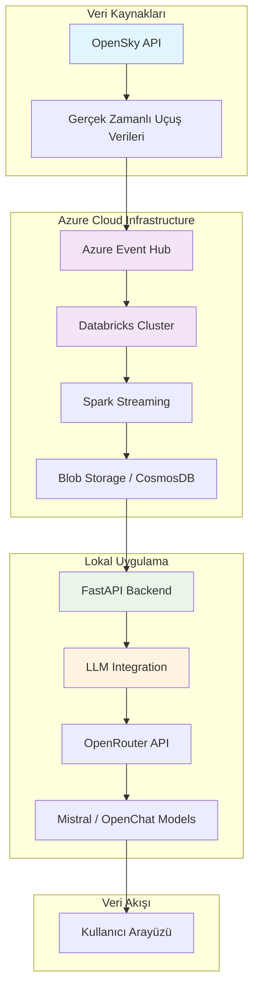

# 🛫 Gerçek Zamanlı Uçuş Verisi Analiz Sistemi

Azure Cloud ve LLM tabanlı akıllı uçuş verisi analiz platformu. Gerçek zamanlı uçuş verilerini toplar, işler ve AI destekli analizler sunar.

## 🏗️ Sistem Mimarisi



## 🚀 Özellikler

- **Gerçek Zamanlı Veri Toplama**: OpenSky API üzerinden canlı uçuş verileri
- **Azure Cloud Integration**: Event Hubs ve Databricks ile ölçeklenebilir veri işleme
- **LLM Destekli Analiz**: AI modelleri ile akıllı sorgulama ve analiz
- **Streaming Architecture**: Kafka benzeri Event Hub ile sürekli veri akışı
- **Spark Processing**: Big Data işleme ve dönüşüm yetenekleri

## 🛠️ Teknoloji Stack'i

| Katman | Teknoloji |
|--------|-----------|
| **Cloud & Veri Akışı** | Azure Event Hubs, Databricks, Blob/CosmosDB |
| **Gerçek Zamanlı Veri** | OpenSky API |
| **LLM (AI)** | OpenRouter API + LangChain + Open Source Modeller |
| **Web Backend** | FastAPI |
| **Veri Formatı** | JSON, Streaming, Kafka-compatible |
| **AI Prompt Engineering** | Özelleştirilmiş, veriyle zenginleştirilmiş prompt yapısı |

## 📋 Ön Gereksinimler

- Azure CLI yüklü ve yapılandırılmış
- Python 3.8+
- Azure aboneliği
- OpenRouter API anahtarı
- OpenSky API erişimi

## ⚙️ Azure Cloud Kurulumu

### 1. Resource Group Oluşturma
```bash
az group create --name flight-rg --location westeurope
```

### 2. Storage Account Oluşturma
```bash
# Storage account oluşturma (önceden oluşturulmuş olmalı)
az storage account create \
  --name flightstoragecan \
  --resource-group flight-rg \
  --location westeurope \
  --sku Standard_LRS
```


### 3. Storage Container Oluşturma
```bash
# Storage account oluşturma (önceden oluşturulmuş olmalı)
az storage container create \
  --name flightdata \
  --account-name flightstoragecan \
  --auth-mode login
```

### 4. Event Hub Namespace Oluşturma
```bash
az eventhubs namespace create \
  --name flight-ns \
  --resource-group flight-rg \
  --location westeurope \
  --sku Standard
```

### 5. Event Hub Oluşturma
```bash
az eventhubs eventhub create \
  --name flight-events \
  --namespace-name flight-ns \
  --resource-group flight-rg \
  --partition-count 2
```

### 6. Connection String Alma
```bash
az eventhubs namespace authorization-rule keys list \
  --resource-group flight-rg \
  --namespace-name flight-ns \
  --name RootManageSharedAccessKey
```

### 7. Databricks Workspace Oluşturma
```bash
az databricks workspace create \
  --resource-group flight-rg \
  --name flight-workspace \
  --location westeurope
```

## 🔧 Databricks Yapılandırması

### Cluster Oluşturma
Databricks workspace'e giriş yaptıktan sonra:

1. **Compute** → **Create Cluster** seçin
2. Cluster ayarları:
   - **Cluster name**: `flight-cluster`
   - **Databricks runtime**: `13.3 LTS (Scala 2.12, Spark 3.4.1)`
   - **Node type**: `Standard_DS3_v2` (geliştirme için)
   - **Workers**: 1-3 arası

### Azure Event Hub Spark Kütüphanesi Ekleme
**ÖNEMLİ**: Cluster oluşturduktan sonra mutlaka bu adımları izleyin:

1. Oluşturduğunuz cluster'a tıklayın
2. **Libraries** sekmesine gidin
3. **Install New** butonuna tıklayın
4. **Maven** seçeneğini seçin
5. **Coordinates** alanına şunu yazın:
   ```
   com.microsoft.azure:azure-eventhubs-spark_2.12:2.3.22
   ```
6. **Install** butonuna tıklayın
7. Cluster'ı **restart** edin

### Gerekli Python Kütüphaneleri
```python
# Databricks notebook'unda çalıştır
%pip install azure-eventhub
%pip install pyspark
```

## 🐍 Python Uygulaması Kurulumu

### Environment Variables Ayarı
Projenin root dizininde `.env` dosyası oluşturun:
```bash
OPENROUTER_API_KEY=your_openrouter_api_key_here
EVENT_HUB_CONNECTION_STR=your_event_hub_connection_string
EVENTHUB_NAME=flight-events
BLOB_ACCOUNT=flightstoragecan
BLOB_KEY=your_blob_storage_key
BLOB_CONTAINER=flightdata
```

### Gerekli Paketler
```bash
pip install -r requirements.txt
```

### Proje Yapısı
```
flight-analysis/
├── /backend/
│   ├── producer.py          # OpenSky API'den veri toplama
│   ├── get_flights.py       # Azure'dan veri okuma
│   ├── ask_llm.py          # LLM entegrasyonu
│   └── main.py             # FastAPI ana uygulama
├── /frontend/
│   ├── index.html          # Ana sayfa
│   └── app.js             # Frontend JavaScript
├── requirements.txt        # Python bağımlılıkları
└── .env                   # Environment variables
```

## 🔄 Veri Akış Süreci

### 1. Veri Toplama (producer.py)
```python
# OpenSky API'den gerçek zamanlı uçuş verileri al
# Azure Event Hub'a gönder
```

### 2. Veri İşleme (Databricks)
```python
# Spark Streaming ile Event Hub'dan oku
# Verileri temizle ve dönüştür
# Blob Storage veya CosmosDB'ye kaydet
```

### 3. LLM Analizi (ask_llm.py)
- Kullanıcı sorgularını al
- Uçuş verileriyle zenginleştirilmiş prompt oluştur
- LLM modelinden yanıt al
- Sonuçları formatla ve döndür

## 🧠 LLM Entegrasyonu Detayları

### Prompt Engineering Geliştirmeleri
| Özellik | Açıklama |
|---------|----------|
| **Tam Veri Kullanımı** | İlk 3 veri yerine tüm veriyi gönderdik |
| **Zenginleştirilmiş Prompt** | İstatistiksel analiz ve sadeleştirilmiş veriyle GPT'ye tam bağlam |
| **Uygun Model Seçimi** | Mistral, OpenChat gibi etkili modeller |
| **Doğruluk Artırımı** | Varsayım yapmadan sadece veriyle cevap verecek şekilde yönlendirme |

### Kullanılan Fonksiyonlar
```python
def build_enhanced_prompt(user_question, flight_data):
    # Veri analiziyle zenginleştirilmiş prompt oluştur
    pass

def load_flight_data():
    # Azure'dan uçuş verilerini yükle
    pass
```

## 🚦 Sistem Çalıştırma

### 1. Environment Variables Ayarla
```bash
# .env dosyasını oluştur ve API key'lerini ekle
cp .env.example .env
# .env dosyasını düzenle
```

### 2. Veri Prodüktörü Başlat
```bash
cd backend
python producer.py
```

### 3. Databricks Notebook Çalıştır
- Databricks workspace'te streaming notebook'u çalıştır
- Maven kütüphanesinin yüklendiğinden emin ol

### 4. FastAPI Uygulamasını Başlat
```bash
uvicorn backend.main:app --reload
```

### 5. Frontend'i Başlat
```bash
# frontend dizininde basit HTTP server başlat
cd frontend
python -m http.server 3000
# veya Node.js kullanıyorsan
npx live-server --port=3000
```

### 6. Sistem Test Et
```bash
# Uçuş verilerini al
curl http://localhost:8000/get-flights

# LLM ile sorgula
curl -X POST http://localhost:8000/ask-llm \
  -H "Content-Type: application/json" \
  -d '{"question": "En yüksek irtifada uçan uçak hangisi?"}'
```

## 📊 API Endpoints

| Endpoint       | Method | Açıklama |
|----------------|--------|----------|
| `/get-flights` | GET | Uçuş verilerini getir |
| `/send-flight` | POST | Uçuş verilerini gönder |
| `/ask-llm`     | POST | LLM ile sorgula |

## 🔍 Monitoring ve Logs

### Azure Portal'dan İzleme
- Event Hub metrics
- Databricks cluster performance
- Storage account usage

### Lokal Loglar
```python
import logging
logging.basicConfig(level=logging.INFO)
```

## 🛡️ Güvenlik

- Azure Active Directory entegrasyonu
- **API anahtarları `.env` dosyasında** güvenli şekilde saklanmalı
- `.env` dosyası `.gitignore`'a eklenmelidir
- Connection stringler environment variables olarak yönetilmeli
- Production'da Azure Key Vault kullanılmalı

### .gitignore Örneği
```bash
# Environment variables
.env
.env.local
.env.production

# Python
__pycache__/
*.pyc
*.pyo
*.pyd
.Python
env/
venv/
.venv/

# IDE
.vscode/
.idea/

# Logs
*.log
```

## 📄 Lisans

Bu proje MIT lisansı altında lisanslanmıştır.

## 📞 İletişim

Proje sahibi: [Can Kümet]
Email: [cankumet@gmail.com]
GitHub: [github.com/CanKumet]

---
